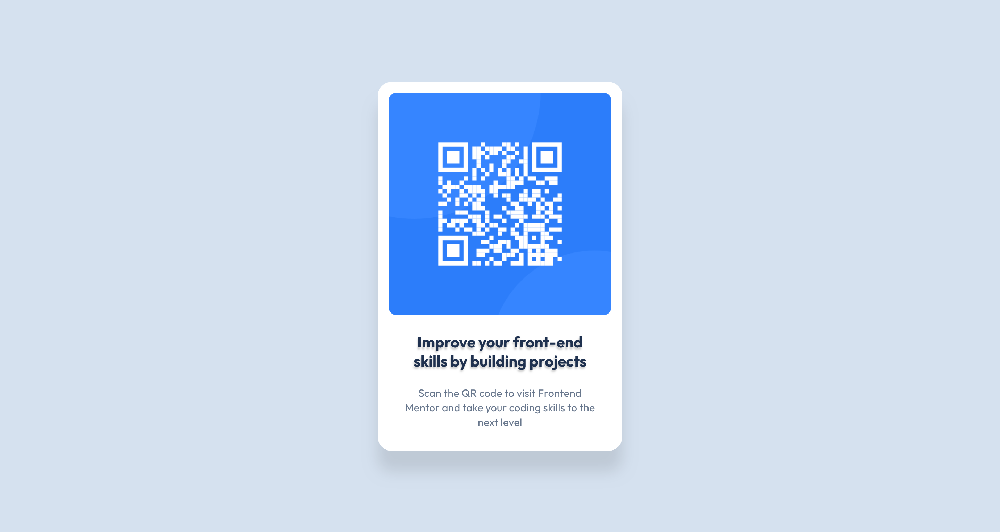

# Frontend Mentor - QR code component solution

This is a solution to the [QR code component challenge on Frontend Mentor](https://www.frontendmentor.io/challenges/qr-code-component-iux_sIO_H). Frontend Mentor challenges help you improve your coding skills by building realistic projects. 

## Table of contents

- [Overview](#overview)
  - [Screenshot](#screenshot)
  - [Links](#links)
- [My process](#my-process)
  - [Built with](#built-with)
  - [What I learned](#what-i-learned)
  - [Continued development](#continued-development)
  - [Useful resources](#useful-resources)

## Overview

### Screenshot

### Links

- Solution URL: [Add solution URL here](https://your-solution-url.com)
- Live Site URL: [Add live site URL here](https://your-live-site-url.com)

## My process

### Built with

- Semantic HTML5 markup
- Flexbox

### What I learned

- Using flexbox to arrange the overall layout of the website
- Adding shadows to elements using box shadow and text shadow
- Deploying to Vercel

### Continued development

I am planning to utilize CSS for a more complex design.

### Useful resources

- [[CSS] - How to Add a Shadow to Text with CSS](https://www.shecodes.io/athena/22835-how-to-add-a-shadow-to-text-with-css) - how to set the right shadow color
- [text-shadow](https://developer.mozilla.org/en-US/docs/Web/CSS/text-shadow) - how to use text box
- [CSS box-shadow Property](https://www.w3schools.com/cssref/css3_pr_box-shadow.php) - This site helps me to understand how to use box shadow

## Author

- GitHub - [theopenhighway](https://github.com/theopenhighway)